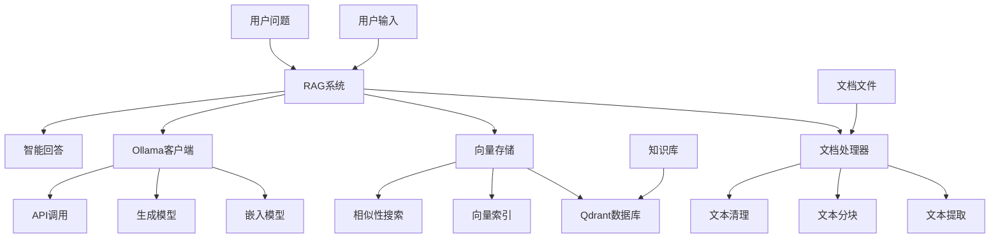
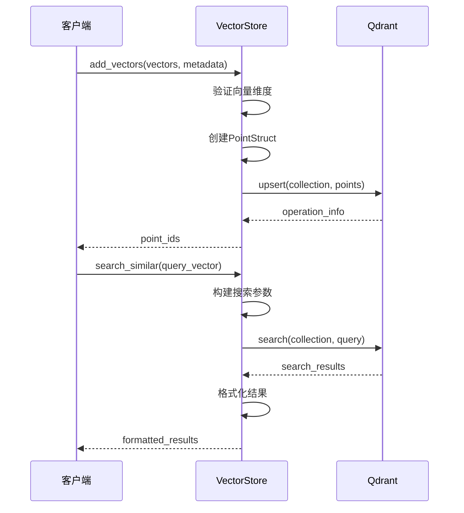
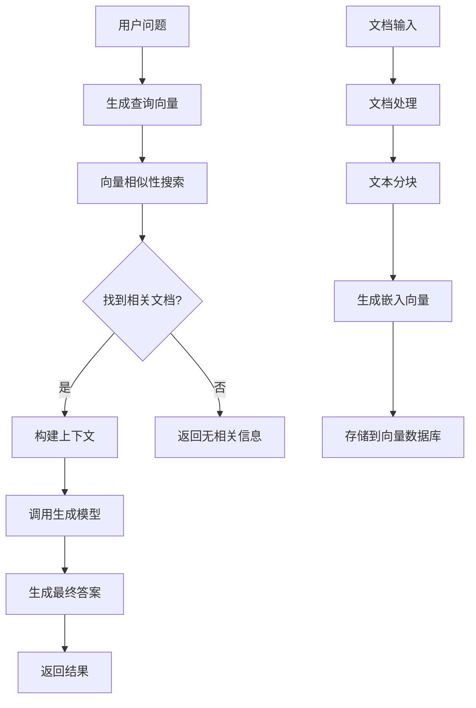
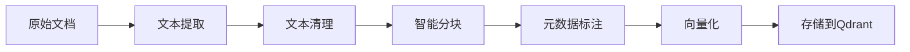

# RAG知识库系统设计文档

## 系统概述

本项目实现了一个基于Qdrant向量数据库和Ollama大语言模型的RAG（检索增强生成）知识库系统。系统能够处理多种格式的文档，将其转换为向量存储，并通过语义搜索为用户提供准确的问答服务。

## 系统架构



## 核心组件

### 1. 文档处理器 (DocumentProcessor)

**功能职责:**
- 支持多种文档格式（TXT、PDF、DOCX、MD）
- 文本提取和清理
- 智能文本分块
- 元数据管理

**核心算法:**
```python
def split_text_into_chunks(self, text: str) -> List[Dict[str, Any]]:
    # 1. 文本清理
    cleaned_text = self.clean_text(text)
    
    # 2. 按固定大小分块
    chunks = []
    start = 0
    while start < len(cleaned_text):
        end = start + self.chunk_size
        
        # 3. 在句子边界分割
        if end < len(cleaned_text):
            sentence_end = find_sentence_boundary(cleaned_text, end)
            if sentence_end > 0:
                end = sentence_end
        
        # 4. 创建文本块
        chunk = create_chunk(cleaned_text[start:end], start, end)
        chunks.append(chunk)
        
        # 5. 计算下一块起始位置（考虑重叠）
        start = max(start + 1, end - self.chunk_overlap)
    
    return chunks
```

**设计特点:**
- 智能边界检测：在句号、问号等标点处分割
- 重叠机制：保证上下文连续性
- 元数据保留：记录来源文件、位置信息

### 2. 向量存储 (VectorStore)

**功能职责:**
- Qdrant数据库连接管理
- 向量存储和索引
- 相似性搜索
- 集合管理

**核心流程:**


**关键特性:**
- 自动集合管理：检查并创建必要的集合
- 维度适配：自动处理向量维度不匹配
- 灵活搜索：支持过滤条件和阈值设置
- 错误恢复：支持内存模式作为备选方案

### 3. Ollama客户端 (OllamaClient)

**功能职责:**
- 本地Ollama服务连接
- 文本向量化（嵌入）
- 文本生成
- 模型管理

**API设计:**
```python
class OllamaClient:
    def get_embedding(self, text: str) -> List[float]:
        """获取文本嵌入向量"""
        
    def generate_response(self, prompt: str, context: str) -> str:
        """生成文本响应"""
        
    def generate_stream_response(self, prompt: str, context: str):
        """流式生成响应"""
```

**优化策略:**
- 连接池管理：复用HTTP连接
- 超时控制：防止长时间等待
- 错误重试：提高系统稳定性
- 流式输出：改善用户体验

### 4. RAG系统主控制器 (RAGSystem)

**核心工作流程:**



**关键算法:**

1. **文档索引流程:**
```python
def add_document(self, file_path: str) -> bool:
    # 1. 文档解析和分块
    chunks = self.document_processor.process_document(file_path)
    
    # 2. 批量生成嵌入向量
    vectors = []
    for chunk in chunks:
        embedding = self.ollama_client.get_embedding(chunk['text'])
        vectors.append(embedding)
    
    # 3. 存储到向量数据库
    point_ids = self.vector_store.add_vectors(vectors, metadata_list)
    
    return len(point_ids) > 0
```

2. **问答检索流程:**
```python
def ask(self, question: str) -> Dict[str, Any]:
    # 1. 生成问题的嵌入向量
    query_embedding = self.ollama_client.get_embedding(question)
    
    # 2. 搜索相关文档
    search_results = self.vector_store.search_similar(
        query_vector=query_embedding,
        top_k=self.top_k_results
    )
    
    # 3. 构建上下文
    context = self.build_context(search_results)
    
    # 4. 生成答案
    answer = self.ollama_client.generate_response(
        prompt=question,
        context=context
    )
    
    return {
        'question': question,
        'answer': answer,
        'sources': search_results
    }
```

## 数据流设计

### 文档处理数据流



### 查询处理数据流


## 性能优化策略

### 1. 向量搜索优化
- **索引策略**: 使用HNSW算法进行高效近似搜索
- **批量处理**: 支持批量向量插入和搜索
- **缓存机制**: 缓存常用查询结果

### 2. 文本处理优化
- **并行处理**: 多线程处理大文档
- **内存管理**: 流式处理大文件
- **格式优化**: 针对不同格式优化解析策略

### 3. 模型调用优化
- **连接复用**: HTTP连接池
- **请求合并**: 批量处理嵌入请求
- **超时控制**: 避免长时间等待

## 配置管理

### 环境变量配置

```env
# Qdrant配置
QDRANT_HOST=localhost
QDRANT_PORT=6333
QDRANT_COLLECTION_NAME=knowledge_base

# Ollama配置
OLLAMA_HOST=localhost
OLLAMA_PORT=11434
OLLAMA_EMBEDDING_MODEL=qwen2.5:4b
OLLAMA_CHAT_MODEL=qwen2.5:14b

# RAG系统配置
CHUNK_SIZE=512
CHUNK_OVERLAP=50
TOP_K_RESULTS=5
SIMILARITY_THRESHOLD=0.7
EMBEDDING_DIMENSION=1024
```

### 配置说明

| 参数 | 说明 | 默认值 | 建议范围 |
|------|------|--------|----------|
| CHUNK_SIZE | 文本块大小 | 512 | 256-1024 |
| CHUNK_OVERLAP | 块重叠大小 | 50 | 10-100 |
| TOP_K_RESULTS | 检索结果数量 | 5 | 3-10 |
| SIMILARITY_THRESHOLD | 相似度阈值 | 0.7 | 0.5-0.9 |

## 错误处理和容错机制

### 1. 连接错误处理
- Qdrant连接失败时自动切换到内存模式
- Ollama服务不可用时提供明确错误信息
- 网络超时自动重试机制

### 2. 数据处理错误
- 文档格式不支持时跳过并记录
- 向量维度不匹配时自动调整
- 文本编码错误时尝试多种编码

### 3. 业务逻辑错误
- 搜索无结果时返回友好提示
- 生成失败时提供备选方案
- 系统状态异常时提供诊断信息

## 扩展性设计

### 1. 模型扩展
- 支持多种嵌入模型切换
- 支持不同生成模型配置
- 支持模型性能对比

### 2. 存储扩展
- 支持分布式Qdrant集群
- 支持多集合管理
- 支持数据备份和恢复

### 3. 功能扩展
- 支持多模态文档处理
- 支持实时文档更新
- 支持用户权限管理

## 监控和日志

### 日志级别
- **DEBUG**: 详细的调试信息
- **INFO**: 一般操作信息
- **WARNING**: 警告信息
- **ERROR**: 错误信息

### 关键指标监控
- 文档处理速度
- 向量搜索延迟
- 答案生成时间
- 系统资源使用率

## 安全考虑

### 1. 数据安全
- 敏感信息过滤
- 访问权限控制
- 数据传输加密

### 2. 系统安全
- 输入验证和清理
- 资源使用限制
- 错误信息脱敏

## 部署建议

### 1. 硬件要求
- **CPU**: 8核以上
- **内存**: 16GB以上
- **存储**: SSD 100GB以上
- **GPU**: 可选，用于加速模型推理

### 2. 软件环境
- **操作系统**: Windows 10/11, Linux, macOS
- **Python**: 3.11+
- **Docker**: 最新版本
- **Ollama**: 最新版本

### 3. 生产部署
- 使用Docker Compose进行容器化部署
- 配置负载均衡和高可用
- 设置监控和告警系统
- 定期备份数据和配置

## 总结

本RAG系统采用模块化设计，各组件职责清晰，接口简洁。通过合理的架构设计和优化策略，系统能够高效处理文档索引和问答查询，为用户提供准确、快速的知识检索服务。系统具有良好的扩展性和容错能力，适合在生产环境中部署使用。